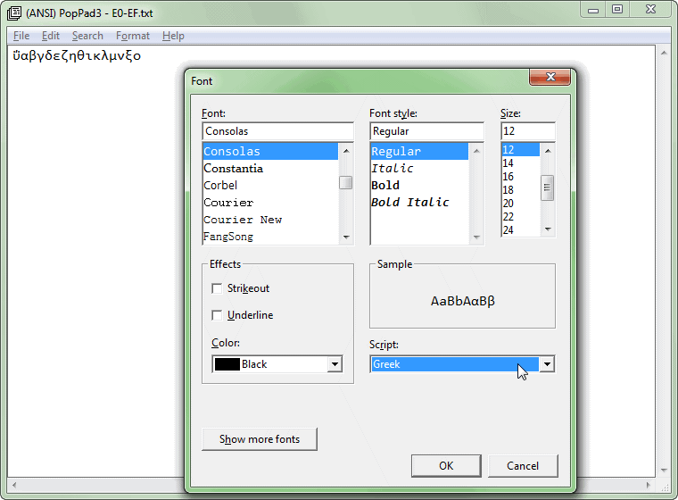
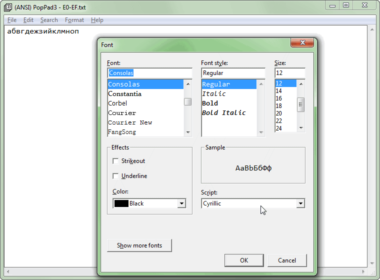

The program works like a simiple Notepad.

If compiled as **ANSI-char** and run on WinXP+, we can see it calling `ChooseFontA` and `CreateFontA`,
and then, see how different **Script** choice can influence the actual characters displayed.

For example, open E0-EF.txt :

  - If Script=Greek, you see Greek characters.
  - If Script=Cyrillic, you see Russian characters.

